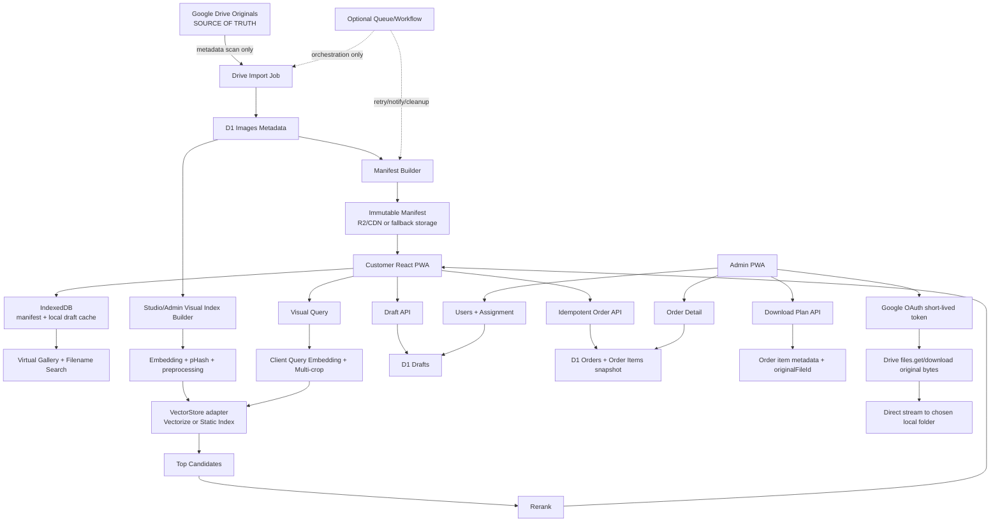

# System Architecture V1

## Architectural rule

Provider SDKs live behind adapters. Business services depend on interfaces, not Cloudflare/Google implementation details.

## Main flow

## Boundaries

- **Web/PWA**: presentation, IndexedDB, local search/filter, optimistic selection state, direct admin download manager.
- **Worker/API**: authz, validation, business rules, metadata plans, D1 transactions. No bulk image processing.
- **D1**: transactional business state and metadata; not original image storage.
- **Drive**: original bytes and canonical file identity (`originalFileId`).
- **R2**: optional disposable derivatives/manifest/vector artifacts.
- **Vector store**: replaceable nearest-neighbor index scoped by project/revision.

## Five largest technical risks and controls

1. **Workers Free CPU (10 ms/invocation)** — keep requests thin; avoid image transforms/model inference/password algorithms that require expensive WASM; benchmark password KDF separately before Phase 2.
2. **Drive API quota/policy changed in 2026** — batch metadata operations, exponential backoff, resumable importer, admin direct downloads, adapter boundary, usage telemetry.
3. **Vectorize free stored dimensions** — active-revision retention, purge completed jobs, support lower dimensions if benchmark passes, StaticVectorIndex fallback.
4. **R2 free storage (10 GB-month)** — derivatives only, lifecycle purge, Drive thumbnail fallback, no original duplication.
5. **Browser direct-download compatibility** — Chrome/Edge File System Access primary; feature-detect and provide a safe fallback path without server-side GB ZIP/proxy.

## Free-tier posture

The architecture must remain functional without Workers AI, paid compute, paid VPS, or a permanently available Vectorize/R2 quota. These are accelerators/providers, not business-logic dependencies.
